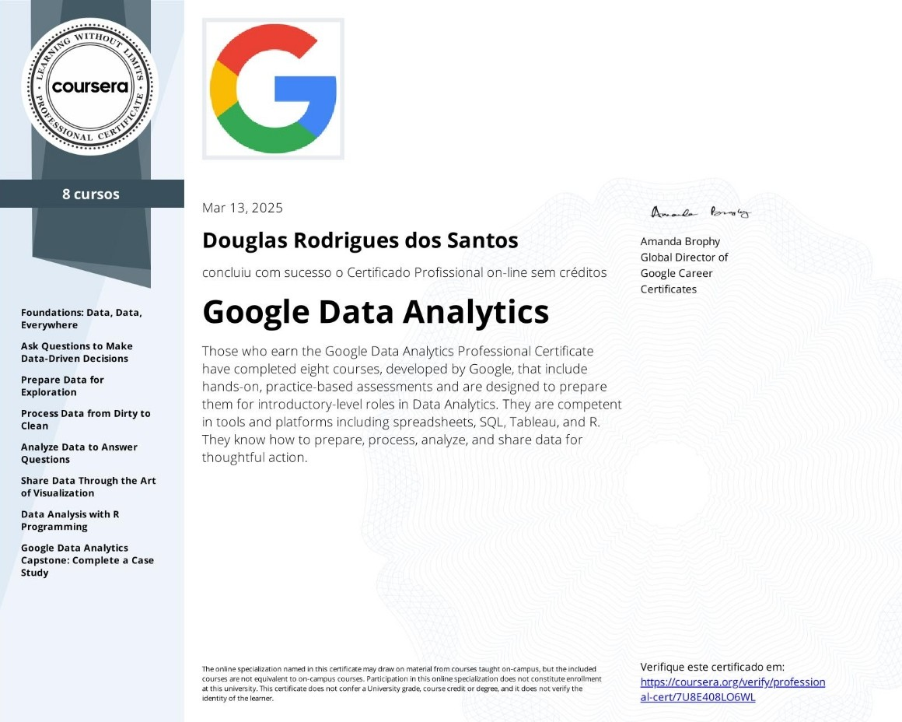

<!-- Cabeçalho animado neon -->
<h1 align="center">
  
</h1>

<!-- Sobre mim -->
<table width="100%" style="color:#00ffee; font-family: 'Segoe UI', Tahoma, Geneva, Verdana, sans-serif; font-weight:600; table-layout: fixed;">
  <tr>
    <td width="50%" style="padding: 20px; border-right: 1px solid #00ffee; vertical-align: top;">
      <h2 style="color:#00ffee;">👤 Sobre mim</h2>
      

        Sou <strong>Douglas</strong>, desenvolvedor apaixonado por tecnologia e inovação. 
        Estudo desenvolvimento de sistemas com foco em <em>back-end</em> (Python/Django) e análise de dados. 
        Busco construir sistemas com design futurista e acessível para o futuro da tecnologia.
      

    </td>
    <td width="50%" style="padding: 20px; text-align:center; vertical-align: top;">
      
    </td>
  </tr>
</table>

<!-- Estudos -->
<table width="100%" style="color:#00ffee; font-family: 'Segoe UI', Tahoma, Geneva, Verdana, sans-serif; font-weight:600; table-layout: fixed;">
  <tr>
    <td width="50%" style="padding: 20px; border-right: 1px solid #00ffee; vertical-align: top;">
      
    </td>
    <td width="50%" style="padding: 20px; vertical-align: top;">
      <h2 style="color:#00ffee;">📚 O que estou estudando</h2>
      <ul style="font-size:16px; line-height:1.5; color:#66fff0; margin: 0;">
        <li>Django avançado (autenticação, APIs, segurança)</li>
        <li>Visualização de dados com Plotly</li>
        <li>Dashboards interativos e painéis inteligentes</li>
        <li>Práticas de segurança e autenticação moderna</li>
      </ul>
    </td>
  </tr>
</table>

<!-- Hobbies e interesses -->
<table width="100%" style="color:#00ffee; font-family: 'Segoe UI', Tahoma, Geneva, Verdana, sans-serif; font-weight:600; table-layout: fixed;">
  <tr>
    <td width="50%" style="padding: 20px; border-right: 1px solid #00ffee; vertical-align: top;">
      <h2 style="color:#00ffee;">🎯 Hobbies e interesses</h2>
      <ul style="font-size:16px; line-height:1.5; color:#66fff0; margin: 0;">
        <li>Apreciar jogos eletrônicos</li>
        <li>Análise de dados e storytelling com gráficos dinâmicos</li>
        <li>Criação de ferramentas para auxilio sociais</li>
        <li>Práticas sobre UI/UX</li>
      </ul>
    </td>
    <td width="50%" style="padding: 20px; vertical-align: top;">
      
    </td>
  </tr>
</table>

<!-- Contato -->
<h2 align="center" style="font-family: 'Orbitron', sans-serif; color:#00ffee; font-weight:700;">🌐 Contato</h2>

  
  
  
  

<!-- Troféus GitHub no topo -->
<h2 align="center" style="font-family: 'Orbitron', sans-serif; color:#9b59b6; font-weight:700; margin-bottom: 0;">
  🏆 GitHub Trophies
</h2>

  

<!-- Estatísticas e linguagens lado a lado, mesma altura -->
<table align="center" width="100%" style="max-width: 900px; margin: auto; border-collapse: separate; border-spacing: 20px;">
  <tr valign="top">
    <td width="60%" align="center" style="background:#1e1e2f; border-radius: 10px; padding: 20px; box-sizing: border-box;">
      <h2 style="font-family: 'Orbitron', sans-serif; color:#9b59b6; font-weight:700; margin-bottom: 10px;">📊 Estatísticas GitHub</h2>
      
       
      
    </td>
    <td width="40%" align="center" style="background:#1e1e2f; border-radius: 10px; padding: 20px; box-sizing: border-box;">
      <h2 style="font-family: 'Orbitron', sans-serif; color:#9b59b6; font-weight:700; margin-bottom: 10px;">🛠️ Linguagens mais usadas</h2>
      
    </td>
  </tr>
</table>

<!-- Certificado -->
<h2 align="center" style="font-family: 'Orbitron', sans-serif; color:#00ffee; font-weight:700;">📜 Certificado Google Data Analytics</h2>

  

  Certificação Profissional Google Data Analytics  
  Emitido pelo Google via Coursera  
  <a href="https://www.coursera.org/account/accomplishments/specialization/7U8E408LO6WL" target="_blank" style="color:#00ffee; text-decoration:none;">🔗 Ver certificado completo</a>

  

